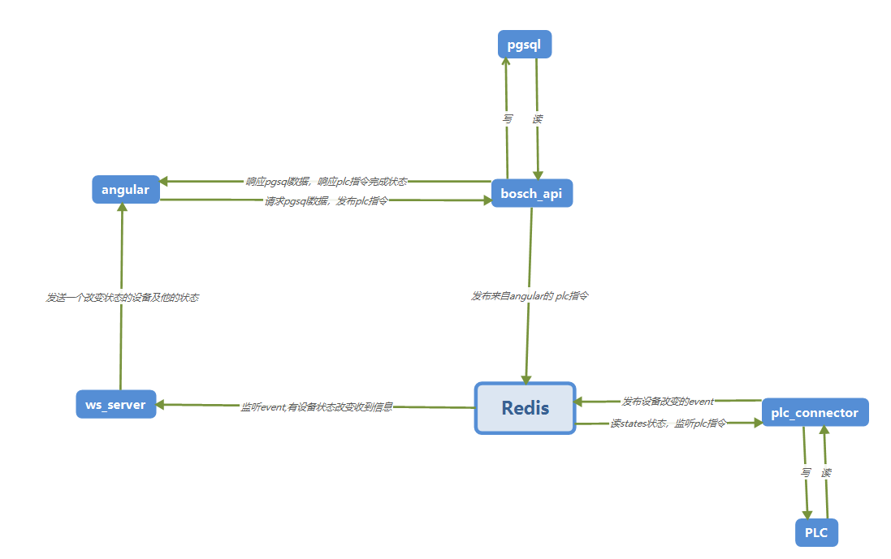

# bosch-project
该项目将力士乐扭矩枪、马头扭矩枪、照样机、压机(暂时没集成)、防错信号灯等设备集成在一起的系统，可以实时采集扭矩枪、压机的数据及灯的状态。
### plc
plc文件主要负责与plc交互
### bosch_angular
系统的主要逻辑及页面的展示
### bosch_api
后端与数据库的连接的API
### toruqe&camera
照样机及扭矩枪的连接
# requirement
1. nginx >= 1.12.2
2. redis >= 3.2
3. postgresql >= 10.4
4. python >= 3.5 (建议安装anaconda版本)
# instruction

主要逻辑如下：

借鉴了MTQQ轻量级通讯协议，基于redis的订阅/发布来进行交互

# start

该系统基于力士乐扭矩枪、马头扭矩枪等的硬件设备及设置上，相关设置请参阅官方文档

1. 启动 nginx
2. 启动 redis
3. 参考 bosch_angular、bosch_api、pgsql、plc、rexroth文件夹下的README.md

